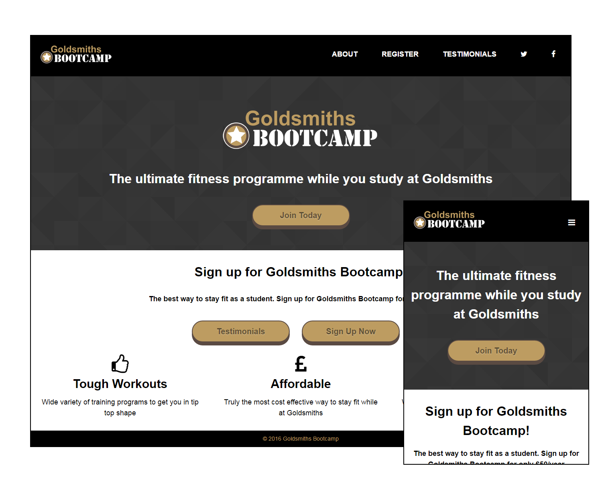

# Responsive Website for Goldsmiths University Bootcamp

This is the repository for Goldsmiths Bootcamp, to view the full website [Click Here](http://doc.gold.ac.uk/~ma301co/Goldsmiths_Bootcamp/). 

I created the responsive layout by taking a "mobile first" approach and building from smallest to largest screen. I used media queries in order for the layout to change depending on what the size of the device is.

On the smaller screen I used some javascript to allow the navigation to slide out when the menu is clicked saving valuable space on smaller screens.

I used mainly PHP for server side form validation and the Swift Mailer library to send responsive HTML emails.

# Languages
- HTML5/CSS3
- Javascript
- PHP

